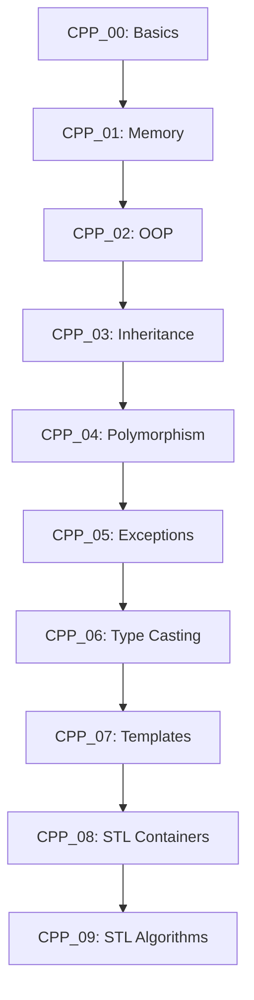

# C++ Learning Journey - 42 School

> **A comprehensive educational resource from C basics to advanced STL programming**

## Overview

This repository contains a complete C++ learning journey through 10 modules, progressively building from basic syntax to advanced STL algorithms and data structures. Each module includes practical exercises and comprehensive documentation.

## 📚 Module Navigation

| Module | Topic | Status | Documentation |
|---------|--------|---------|----------------|
| [CPP_00](cpp_00/README.md) | 📣 Basic C++ & Output | ✅ | [📖 Guide](cpp_00/README.md) |
| [CPP_01](cpp_01/README.md) | 🧟 Memory & Pointers | ✅ | [📖 Guide](cpp_01/README.md) |
| [CPP_02](cpp_02/README.md) | ⚙️ OOP Fundamentals | ✅ | [📖 Guide](cpp_02/README.md) |
| [CPP_03](cpp_03/README.md) | 🧬 Inheritance | ✅ | [📖 Guide](cpp_03/README.md) |
| [CPP_04](cpp_04/README.md) | 🎭 Subtype Polymorphism | ✅ | [📖 Guide](cpp_04/README.md) |
| [CPP_05](cpp_05/README.md) | ⚠️ Exceptions & Repetition | ✅ | [📖 Guide](cpp_05/README.md) |
| [CPP_06](cpp_06/README.md) | 🔄 Type Casting | ✅ | [📖 Guide](cpp_06/README.md) |
| [CPP_07](cpp_07/README.md) | 📝 Templates | 📝 | [📖 Guide](cpp_07/README.md) |
| [CPP_08](cpp_08/README.md) | 📦 STL Containers | 📝 | [📖 Guide](cpp_08/README.md) |
| [CPP_09](cpp_09/README.md) | 🏦 STL Algorithms | 📝 | [📖 Guide](cpp_09/README.md) |

## 🎯 Learning Path Summary

### **Phase 1: Foundations (Modules 00-02)**
- **CPP_00:** Master basic C++ syntax, compilation, and I/O
- **CPP_01:** Understand memory management, pointers, and RAII
- **CPP_02:** Implement Orthodox Canonical Form and basic OOP

### **Phase 2: Object-Oriented Programming (Modules 03-05)**
- **CPP_03:** Explore single inheritance and virtual functions
- **CPP_04:** Master subtype polymorphism and abstract interfaces
- **CPP_05:** Handle exceptions and ensure class invariants

### **Phase 3: Advanced C++ (Modules 06-09)**
- **CPP_06:** Master all four casting operators
- **CPP_07:** Learn template programming fundamentals
- **CPP_08:** Utilize STL containers and iterators
- **CPP_09:** Apply STL algorithms to complex problems

## 🔑 Key Concepts by Module

### **C++ Fundamentals**
- **CPP_00:** String manipulation, character conversion, I/O formatting
- **CPP_01:** Stack vs Heap allocation, destructor semantics, smart pointers (basic)
- **CPP_02:** Copy semantics, assignment operators, operator overloading

### **Object-Oriented Programming**
- **CPP_03:** Virtual tables, inheritance hierarchies, diamond problem
- **CPP_04:** Abstract classes, pure virtual functions, interface design
- **CPP_05:** Exception safety, const correctness, class invariants

### **Advanced Programming**
- **CPP_06:** Type safety, RTTI, memory reinterpretation
- **CPP_07:** Generic programming, template specialization
- **CPP_08:** Container selection, iterator patterns, algorithm usage
- **CPP_09:** Algorithm complexity, optimization techniques, advanced data structures

## 📋 Common Standards & Rules

### **42 School Requirements**
- **Standard:** C++98 (for compatibility)
- **Compilation:** `c++ -Wall -Wextra -Werror -std=c++98`
- **Format:** Orthodox Canonical Form for classes (unless specified otherwise)
- **Headers:** 42 School format with proper include guards
- **Forbidden:** `using namespace`, STL (until module 08), `printf()`, `malloc()/free()`

### **Memory Management**
- Always use `new`/`delete` for dynamic allocation
- Prefer stack allocation when possible
- Follow RAII principles
- Ensure no memory leaks

### **Class Design Principles**
- **Orthodox Canonical Form:** Default constructor, copy constructor, assignment operator, destructor
- **Encapsulation:** Private members, public interface
- **Const correctness:** Use `const` where appropriate

## 🏗️ Build Commands

### **Individual Modules**
```bash
# Build specific module
make -C cpp_00    # Build current module
make -C cpp_01    # Build specific exercise
# ... etc for each module

# Clean individual module
make -C cpp_00 fclean
```

### **Testing Commands**
```bash
# Run exercise tests
./cpp_00/exercise_name    # Replace with actual executable
./cpp_01/zombie_program    # Example for CPP_01
```

## 📚 Educational Resources

### **Primary Documentation**
- **[cppreference](https://en.cppreference.com/)** - Official C++ reference
- **[C++ Standard](https://isocpp.org/)** - C++ language and library standards

### **Educational Resources**
- **[GeeksforGeeks](https://www.geeksforgeeks.org/c-plus-plus/)** - Clear explanations with examples
- **[LearnCpp.com](https://www.learncpp.com/)** - Comprehensive C++ tutorial
- **[42 School Curriculum](https://projects.intra.42.fr/)** - Official requirements

### **By Module**
| Module | Focus | Recommended GeeksforGeeks Topics |
|--------|--------|-------------------------------|
| CPP_00 | Basic Syntax | [C++ Basics](https://www.geeksforgeeks.org/c-plus-plus/), [String Manipulation](https://www.geeksforgeeks.org/string-manipulation-in-cpp/) |
| CPP_01 | Memory | [Pointers](https://www.geeksforgeeks.org/pointers-in-cpp/), [Memory Allocation](https://www.geeksforgeeks.org/memory-management-in-cpp/) |
| CPP_02 | OOP | [Classes](https://www.geeksforgeeks.org/classes-objects-cpp/), [Operator Overloading](https://www.geeksforgeeks.org/operator-overloading-cpp/) |
| CPP_03 | Inheritance | [Inheritance](https://www.geeksforgeeks.org/inheritance-in-c/), [Virtual Functions](https://www.geeksforgeeks.org/virtual-functions-in-cpp/) |
| CPP_04 | Polymorphism | [Abstract Classes](https://www.geeksforgeeks.org/abstract-classes-in-cpp/), [Interfaces](https://www.geeksforgeeks.org/interfaces-in-cpp/) |
| CPP_05 | Exceptions | [Exception Handling](https://www.geeksforgeeks.org/exception-handling-in-cpp/), [Custom Exceptions](https://www.geeksforgeeks.org/user-defined-custom-exceptions-in-cpp/) |
| CPP_06 | Type Casting | [Type Conversion](https://www.geeksforgeeks.org/type-conversion-in-c/), [Casting Operators](https://www.geeksforgeeks.org/static_cast-in-cpp/) |
| CPP_07 | Templates | [Template Basics](https://www.geeksforgeeks.org/templates-cpp/), [Template Specialization](https://www.geeksforgeeks.org/template-specialization-in-c/) |
| CPP_08 | STL Containers | [STL Overview](https://www.geeksforgeeks.org/stl-tutorial-in-c/), [Containers](https://www.geeksforgeeks.org/containers-in-cpp-stl/) |
| CPP_09 | STL Algorithms | [Algorithms](https://www.geeksforgeeks.org/algorithms-in-c-stl/), [Complexity](https://www.geeksforgeeks.org/time-complexity/) |

## 🎯 Module Dependencies



## 🏆 Learning Outcomes

Upon completing all modules, you'll have mastered:

### **C++ Language Fundamentals**
- Complete understanding of C++ syntax and semantics
- Memory management and RAII principles
- Object-oriented programming patterns

### **Advanced Concepts**
- Template metaprogramming fundamentals
- STL container and algorithm usage
- Exception safety and error handling

### **Software Engineering Skills**
- Code organization and modular design
- Testing strategies and debugging techniques
- Performance optimization basics

## 📝 Project Structure

```
CPP/
├── README.md                    # This file - main navigation
├── cpp_00/                     # Basic C++ & Output
│   ├── README.md                 # Module guide
│   ├── exercises/               # Individual exercises
│   └── CPP_00.pdf             # Subject requirements
├── cpp_01/                     # Memory & Pointers
│   ├── README.md                 # Module guide
│   ├── exercises/               # Zombie exercises
│   └── CPP_01.pdf             # Subject requirements
└── ...                          # Continue for all modules
```

## 🚀 Getting Started

1. **For Beginners:** Start with [CPP_00](cpp_00/README.md)
2. **With C++ Experience:** Jump to appropriate module based on your current level
3. **For Review:** Use the navigation table above to jump between topics
4. **For Reference:** Use the detailed module guides as quick reference

## 📖 How to Use This Repository

### **Learning Path**
- Follow the modules in order for progressive learning
- Each module builds upon concepts from previous ones
- Complete all exercises before moving to the next module

### **Reference Usage**
- Use module READMEs as quick reference for specific topics
- Follow the provided links for deeper understanding
- Use the build commands as templates for your own projects

### **Troubleshooting**
- Check module-specific READMEs for common issues
- Use the provided resources for additional help
- Each module includes common pitfalls and solutions

---

## 🔗 Quick Links

- **[Current Module: CPP_06 Type Casting](cpp_06/README.md)** - Complete guide to C++ casting operators
- **[Module Progression](#module-dependencies)** - Visual learning path
- **[Build Commands](#build-commands)** - Compilation and testing instructions
- **[Educational Resources](#educational-resources)** - Learning materials by topic

---

**🎓 Welcome to your C++ learning journey!** Each module is designed to build practical skills while understanding theoretical concepts. Start where you feel comfortable and progress at your own pace.